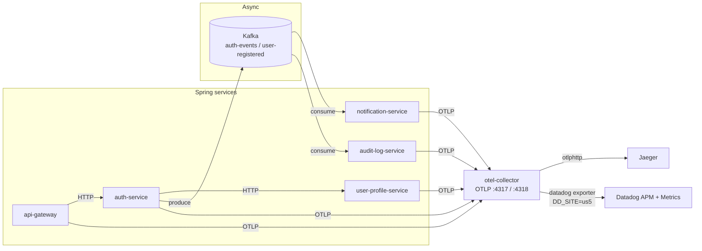
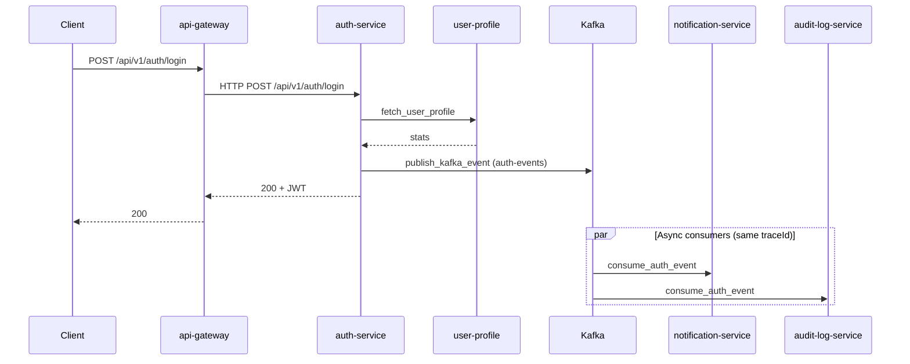
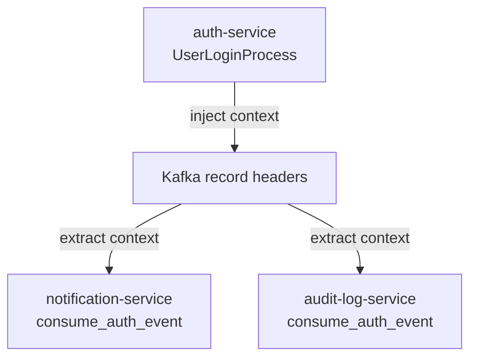
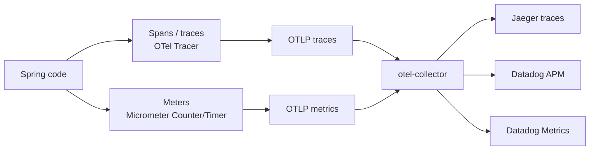

# Observability Lessons — OpenTelemetry, Jaeger & Datadog

Hands-on lessons from **spring-datadog-lab**: how traces and metrics flow from Spring Boot microservices through an OpenTelemetry Collector to **Jaeger** (local) and **Datadog us5** (SaaS).

Screenshots live under [`images/observability/`](images/observability/).  
Checklist / smoke commands: [`OBSERVABILITY_WALKTHROUGH.md`](OBSERVABILITY_WALKTHROUGH.md).

| | |
|--|--|
| **Stack** | Spring Boot 4.1 · Java 25 · Micrometer OTLP · OTel Collector Contrib |
| **K8s ns** | `spring-datadog-lab` |
| **Datadog** | [us5.datadoghq.com](https://us5.datadoghq.com) |
| **Example Trace ID** | `49d718ae2f20f925d71046c7f238a3c3` (login, ~526 ms) |

---

## Lesson 1 — Architecture: one pipeline, two backends

Apps speak **only OTLP**. They do not embed a Datadog agent SDK. The collector dual-exports:



**Why this shape?**

| Choice | Lesson |
|--------|--------|
| Apps → OTLP only | Vendor-agnostic; swap Jaeger/Datadog without changing business code |
| Collector dual-export | Same spans in Jaeger (fast local debug) and Datadog (dashboards, SLOs) |
| Kafka in the middle | Trace context must propagate into message headers or consumers become orphan traces |

Collector pipelines (K8s):

```yaml
# deploy/k8s/otel/collector-config.yaml (concept)
traces:  receivers: [otlp] → exporters: [datadog, otlphttp/jaeger, debug]
metrics: receivers: [otlp] → exporters: [datadog, debug]
```

**Port trap (this laptop):** FleetForge Jaeger often sits on `:16686` (`gateway-service`, …). Lab Jaeger is:

| Target | URL |
|--------|-----|
| K8s lab (port-forward) | `http://127.0.0.1:19668` |
| Compose lab | `http://127.0.0.1:9668` |

---

## Lesson 2 — Trace search: find the story, not a random span

Start from the **entry service** (`api-gateway`), lookback ~1h, then open a multi-service login/register row (many spans, several services).


Login-focused subset (same Trace ID family):


**What to notice**

- **Services column** = live dependency evidence (gateway → auth → audit/notification).
- **Span count** high (e.g. 15) usually means HTTP + security + Kafka + consumers in one tree.
- Scatter plot = latency outliers before you open a flame graph.

---

## Lesson 3 — Waterfall: sync path vs async fan-out

Same Trace ID in Jaeger and Datadog: `49d718ae2f20f925d71046c7f238a3c3`.

### Jaeger waterfall




**Reading the Gantt**

| Phase | Spans (examples) | Blocking user? |
|-------|------------------|----------------|
| Sync | `http post` → `UserLoginProcess` → `fetch_user_profile` | Yes |
| Handoff | `publish_kafka_event` / `auth-events send` | Brief |
| Async | `consume_auth_event` on notification + audit | No — after JWT returned |

User-visible latency ≈ gateway/auth (~333 ms here). Trace duration (~526 ms) includes background work — that is expected and useful, not a “bug”.

### Datadog flame graph (same story)


**Lesson:** Jaeger = sharp local drill-down; Datadog = same OTLP data plus product UX (facets, maps, correlation).

---

## Lesson 4 — Context propagation across Kafka

Without W3C/traceparent (or equivalent) on the producer, consumers start **new** traces. In this lab, producer and consumers share one Trace ID.


Typical tags you should see on consumer spans:

- `messaging.system` / Kafka client id  
- `otel.scope.name`, `service.version`, `deployment.environment=dev`  
- Custom events (e.g. welcome email) as span events  

Datadog view of the same topology (Map tab):


Kafka producer span selected:




---

## Lesson 5 — Datadog APM: services, explorer, map

### Services + flow map


Expected topology: `api-gateway` → `auth-service` → `apache_kafka` → `notification-service` / `audit-log-service` (+ `user-profile-service` on login path).

### Trace Explorer (live)


Facets mirror Jaeger: services, resources (`UserLoginProcess`, `publish_kafka_event`, `consume_auth_event`, `db_fetch_profile_stats`, …).

**Ingest lag:** often 30–90 s after K8s smoke traffic. Jaeger is usually immediate.

---

## Lesson 6 — Spans vs metrics (and custom business metrics)



| Signal | Answers | Lab examples |
|--------|---------|--------------|
| **Trace / span** | What happened on *this* request? | `UserLoginProcess`, `publish_kafka_event` |
| **Metric** | How often / how fast *over time*? | `auth.login.success`, `auth.token.generation` |

Custom Micrometer meters in this repo:

| Metric | Type | Service |
|--------|------|---------|
| `auth.login.success` | Counter | auth-service |
| `auth.login.failure` | Counter | auth-service |
| `auth.token.generation` | Timer | auth-service |
| `audit.event.processed` | Counter | audit-log-service |
| `profile.stats.fetched` | Counter | user-profile-service |
| `dashboard.summary.views` | Counter | dashboard-service |

After a login smoke, Metrics Explorer → search `auth.login` (OTLP naming may use dots or underscores).

*(Optional screenshots: `09-datadog-metrics-explorer.png`, `10-datadog-metric-query.png`.)*

---

## Lesson 7 — Instrumentation model in Spring

```text
HTTP / Kafka / JDBC  →  Micrometer Observation / OTel auto-instrumentation
Business steps       →  Tracer.spanBuilder("UserLoginProcess") …
Counters / timers    →  MeterRegistry (OTLP registry → collector :4318/v1/metrics)
```

Apps set `management.otlp.*` and `service.name: ${spring.application.name}`.  
K8s overrides endpoints to `http://otel-collector:4318` (+ `/v1/metrics`).

**Do not** point apps at Datadog or Jaeger directly in this lab — the collector is the fan-out point.

---

## Lesson 8 — Reproduce the login story (K8s)

```powershell
kubectl -n spring-datadog-lab port-forward svc/api-gateway 19002:9000
kubectl -n spring-datadog-lab port-forward svc/jaeger 19668:16686

$user = "demo" + (Get-Random -Maximum 99999)
$reg = @{ ssoId = "sso-$user"; username = $user; password = "Password1!" } | ConvertTo-Json
Invoke-RestMethod http://127.0.0.1:19002/api/v1/auth/register -Method Post `
  -Body $reg -ContentType application/json -Headers @{ "X-Tenant-Id" = "acme" }
Invoke-RestMethod http://127.0.0.1:19002/api/v1/auth/login -Method Post `
  -Body (@{ username = $user; password = "Password1!" } | ConvertTo-Json) `
  -ContentType application/json -Headers @{ "X-Tenant-Id" = "acme" }
```

Then:

1. Jaeger `:19668` → service `api-gateway` → open multi-service `http post`  
2. Datadog us5 → [APM Traces](https://us5.datadoghq.com/apm/traces) → same Trace ID / login resource  
3. Compare waterfall ↔ flame graph ↔ Map tab  

---

## Cheat sheet

| Question | Where |
|----------|--------|
| Are lab services emitting? | Jaeger `:19668` services list (not FleetForge `:16686`) |
| Did Kafka keep the same trace? | One Trace ID on publish + consume |
| Is Datadog receiving? | us5 APM Services / Traces; collector log `Sending host metadata` (`name: datadog`) |
| Business rate over time? | Custom counters in Metrics Explorer |
| Deep dive on one request? | Jaeger waterfall or Datadog flame graph |

---

## Related docs

| Doc | Role |
|-----|------|
| [OBSERVABILITY_WALKTHROUGH.md](OBSERVABILITY_WALKTHROUGH.md) | Screenshot checklist + deep links |
| [LOCAL_OBSERVABILITY_ROADMAP.md](LOCAL_OBSERVABILITY_ROADMAP.md) | Ports, phases, K8s notes |
| [OPENTELEMETRY_FUNDAMENTALS.md](OPENTELEMETRY_FUNDAMENTALS.md) | OTel concepts |
| [DATADOG_INTEGRATION.md](DATADOG_INTEGRATION.md) | Datadog APM deep dive |
| [TEST_SCENARIOS_AND_VALIDATION.md](TEST_SCENARIOS_AND_VALIDATION.md) | Broader validation matrix |
