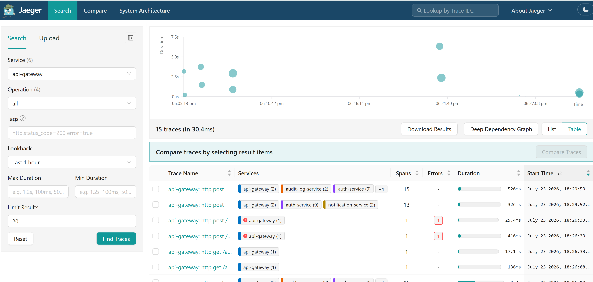
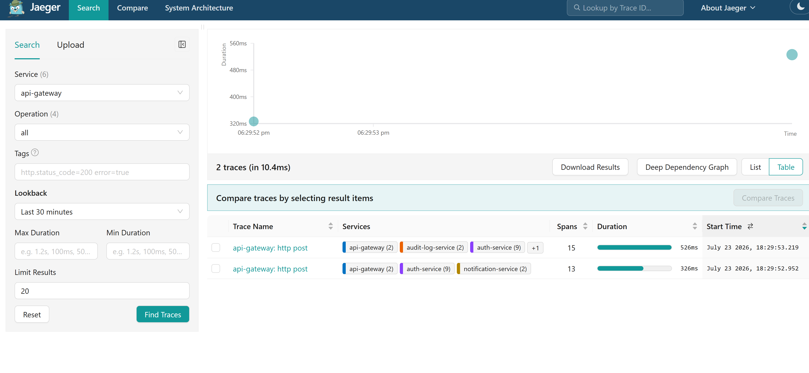
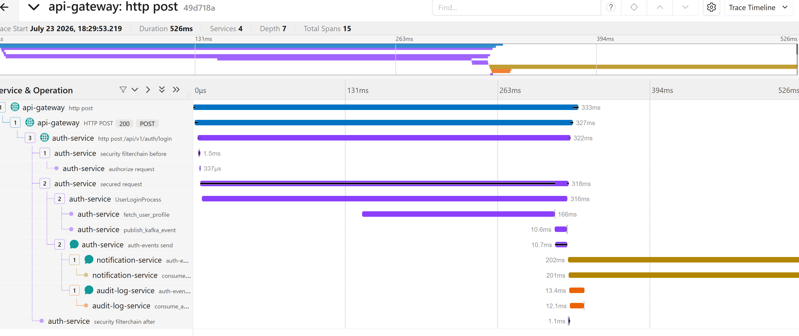
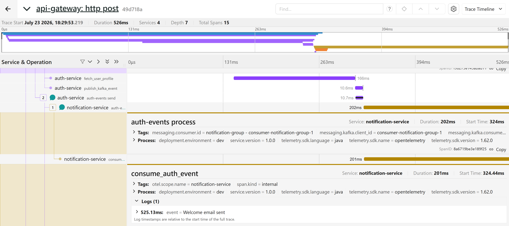
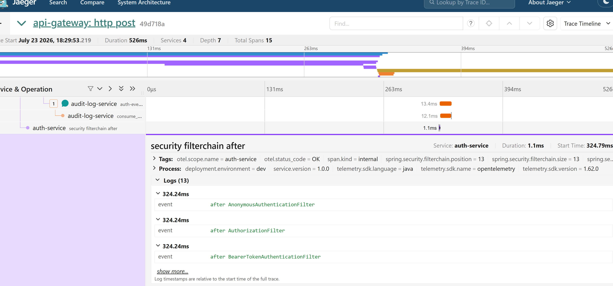
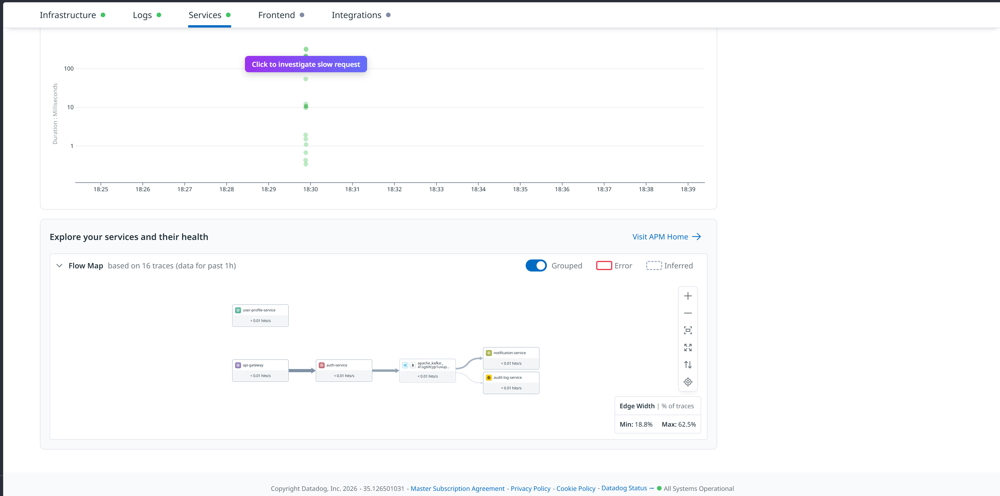
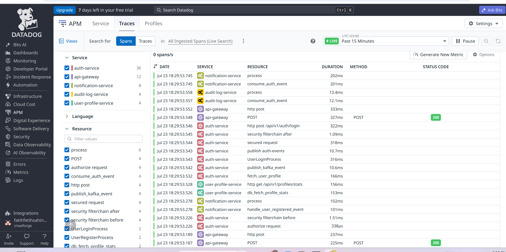
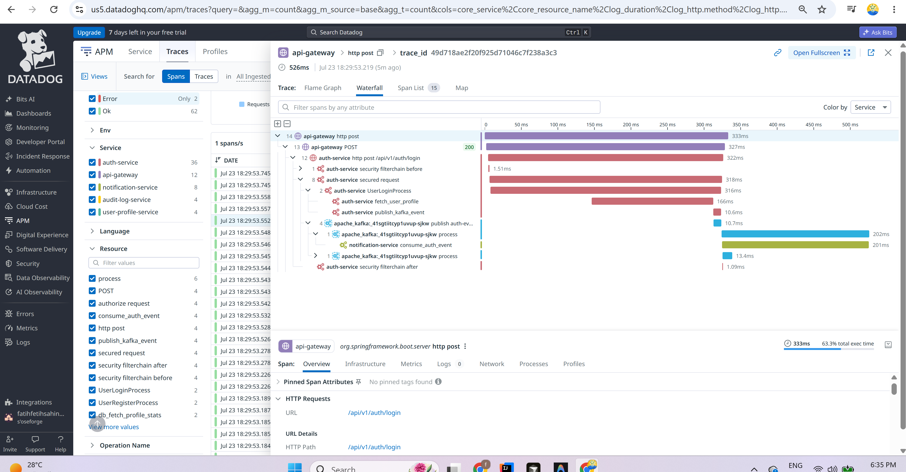
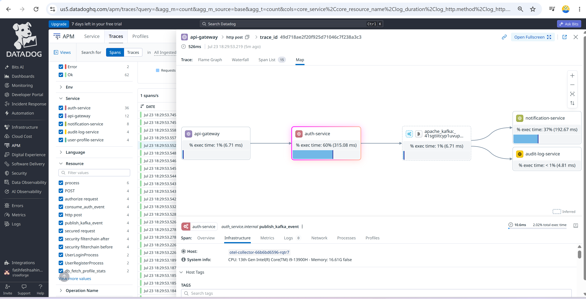
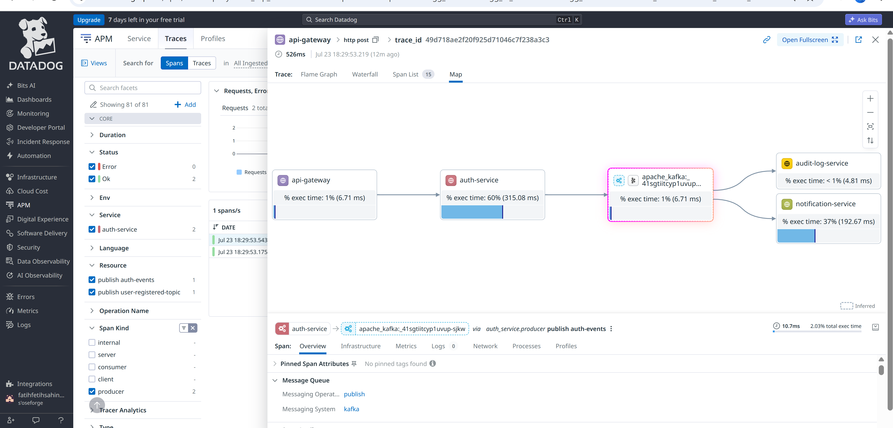

# Observability Walkthrough — OpenTelemetry + Datadog (K8s)

> **Lessons (architecture, diagrams, annotated screenshots):**  
> [`OBSERVABILITY_LESSONS.md`](OBSERVABILITY_LESSONS.md)

Visual checklist for the **spring-datadog-lab** pipeline on Rancher Desktop / K8s.

**Site:** [https://us5.datadoghq.com](https://us5.datadoghq.com)  
**Namespace:** `spring-datadog-lab`  
**Flow:** Spring apps → OTLP → `otel-collector` → **Jaeger** (local) + **Datadog us5** (SaaS)

> Smoke steps below; figures are filled from [`images/observability/`](images/observability/).

---

## 0. Architecture (optional)

```text
┌──────────────┐     OTLP      ┌─────────────────┐
│ api-gateway  │──────────────▶│                 │──otlphttp──▶ Jaeger UI
│ auth-service │               │  otel-collector │
│ notification │◀──Kafka──┐    │  DD_SITE=us5    │──datadog───▶ Datadog APM/Metrics
│ audit / …    │          │    └─────────────────┘
└──────────────┘          │
                          └── user-registered-topic
```


*Paste → `docs/images/observability/01-pipeline-overview.png`*

---

## 1. Generate traffic (K8s)

```powershell
# Gateway + Jaeger port-forwards (pick free local ports)
kubectl -n spring-datadog-lab port-forward svc/api-gateway 19002:9000
kubectl -n spring-datadog-lab port-forward svc/jaeger 19668:16686

# Register + login (paths are /api/v1/auth/**)
$user = "demo" + (Get-Random -Maximum 99999)
$reg = @{ ssoId = "sso-$user"; username = $user; password = "Password1!" } | ConvertTo-Json
Invoke-RestMethod http://127.0.0.1:19002/api/v1/auth/register -Method Post -Body $reg -ContentType application/json -Headers @{ "X-Tenant-Id" = "acme" }
Invoke-RestMethod http://127.0.0.1:19002/api/v1/auth/login -Method Post -Body (@{ username = $user; password = "Password1!" } | ConvertTo-Json) -ContentType application/json -Headers @{ "X-Tenant-Id" = "acme" }
```

Expect **200** + JWT on both calls. Wait ~30–60s for Datadog ingest lag.

---

## 2. OpenTelemetry / Jaeger (local proof)

**UI:** [http://127.0.0.1:19668](http://127.0.0.1:19668)  
**API:** `GET http://127.0.0.1:19668/api/services`

### 2.1 Trace search

Look for: `api-gateway`, `auth-service`, `notification-service`, `audit-log-service`, `user-profile-service`.





### 2.2 Login waterfall

Open Trace ID `49d718ae2f20f925d71046c7f238a3c3` (or newest multi-service login).



### 2.3 Kafka consume + span tags






---

## 3. Datadog us5 — APM (spans / services)

Sign in to Datadog (**US5**), then open the deep links below (adjust time range to **Past 15 minutes** / **1 hour** after smoke traffic).

| Check | Deep link |
|-------|-----------|
| APM Services | [https://us5.datadoghq.com/apm/services](https://us5.datadoghq.com/apm/services) |
| Trace Explorer | [https://us5.datadoghq.com/apm/traces](https://us5.datadoghq.com/apm/traces) |
| Service Map | [https://us5.datadoghq.com/apm/map](https://us5.datadoghq.com/apm/map) |

Suggested Trace Explorer filter (after data appears):

```text
service:(api-gateway OR auth-service OR notification-service)
```

### 3.1 APM Services

Confirm lab services appear (names often match OTel `service.name`).



*Paste → `docs/images/observability/05-datadog-apm-services.png`*

### 3.2 Trace Explorer

Open a login/register trace; note span count and services.



*Paste → `docs/images/observability/06-datadog-trace-explorer.png`*

### 3.3 Flame graph / span list



*Paste → `docs/images/observability/07-datadog-flamegraph.png`*

### 3.4 Service Map (trace topology)



*Paste → `docs/images/observability/08-datadog-service-map.png`*

### 3.5 Kafka producer span (optional)

Same login trace, Kafka `publish` selected — good pair with Jaeger `publish_kafka_event`.



*Paste → `docs/images/observability/08b-datadog-kafka-producer-map.png`*

---

## 4. Datadog us5 — Metrics

| Check | Deep link |
|-------|-----------|
| Metrics Explorer | [https://us5.datadoghq.com/metric/explorer](https://us5.datadoghq.com/metric/explorer) |
| Metrics Summary | [https://us5.datadoghq.com/metric/summary](https://us5.datadoghq.com/metric/summary) |

Try searching for (names vary by Micrometer/OTel mapping):

- `jvm.memory.used` / `process.runtime.jvm.*`
- `http.server.requests` / `http.server.request.duration`
- `otelcol_receiver_accepted_spans` / `otelcol_exporter_sent_spans` (collector self-metrics, if enabled)

### 4.1 Metrics Explorer overview


*Paste → `docs/images/observability/09-datadog-metrics-explorer.png`*

### 4.2 One concrete metric chart


*Paste → `docs/images/observability/10-datadog-metric-query.png`*

---

## 5. Optional K8s / collector evidence

### 5.1 Pods Ready

```powershell
kubectl -n spring-datadog-lab get pods
```


*Paste → `docs/images/observability/11-k8s-pods-ready.png`*

### 5.2 Collector exporting to Datadog

```powershell
kubectl -n spring-datadog-lab logs deploy/otel-collector --tail=200 |
  Select-String -Pattern 'TracesExporter|Sending host metadata|datadog'
```

Healthy signals:

- `TracesExporter` / `MetricsExporter` with `name": "debug"` (data reached collector)
- `Sending host metadata` with `"name": "datadog"` (Datadog exporter talking to us5)
- No repeated `403` / `401` / `invalid_api_key` on the datadog exporter


*Paste → `docs/images/observability/12-otel-collector-logs.png`*

---

## 6. Verification checklist

| # | Check | Local evidence (lab) | Your UI screenshot |
|---|--------|----------------------|--------------------|
| 1 | Register/login via gateway | HTTP 200 + JWT | — |
| 2 | Jaeger services | 5+ app services listed | `02-…` |
| 3 | Jaeger login waterfall + Kafka | Same `traceId` producer/consumer | `03-…`, `04-…` |
| 4 | Collector → Datadog | Host metadata + no auth errors | `12-…` |
| 5 | Datadog APM services / traces | us5 UI (ingest lag ~1–2 min) | `05-…`–`08-…` |
| 6 | Datadog metrics | Metrics Explorer charts | `09-…`, `10-…` |

### API note (optional)

`GET https://api.us5.datadoghq.com/api/v1/validate` works with **API key** only.  
Metrics query / Spans Search usually need **API key + Application key** (`DD-APPLICATION-KEY`). Visual UI check is enough for this lab.

Secret for the collector:

```powershell
pwsh -File .\deploy\scripts\k8s\ensure-datadog-secret.ps1
# DD_SITE is hard-coded to us5.datadoghq.com on the Deployment
```

---

## Related docs

- [LOCAL_OBSERVABILITY_ROADMAP.md](LOCAL_OBSERVABILITY_ROADMAP.md) — ports, phases, K8s notes  
- [DATADOG_INTEGRATION.md](DATADOG_INTEGRATION.md) — APM deep dive  
- [OPENTELEMETRY_FUNDAMENTALS.md](OPENTELEMETRY_FUNDAMENTALS.md) — OTel concepts  
- [TEST_SCENARIOS_AND_VALIDATION.md](TEST_SCENARIOS_AND_VALIDATION.md) — broader test matrix  
